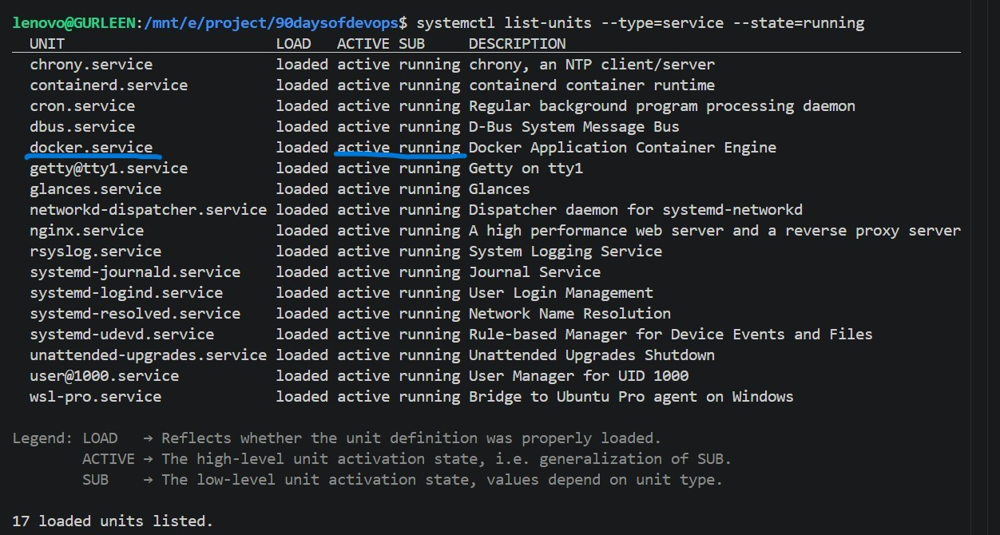
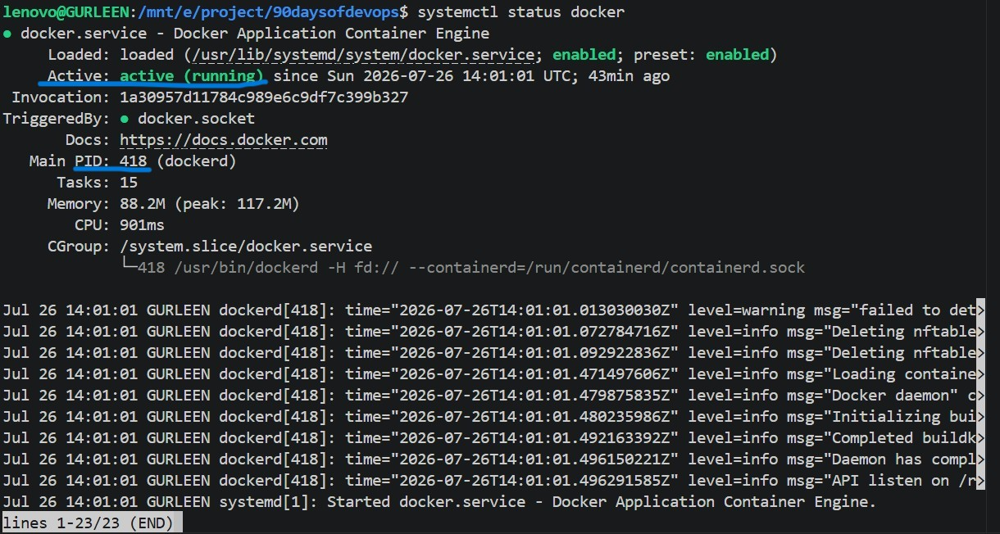
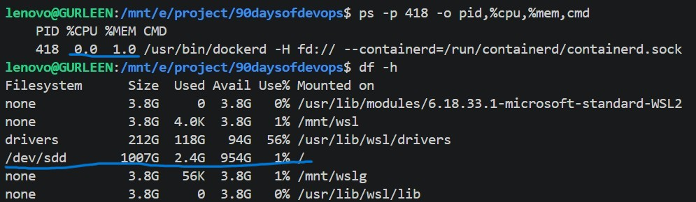
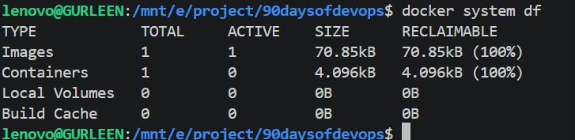
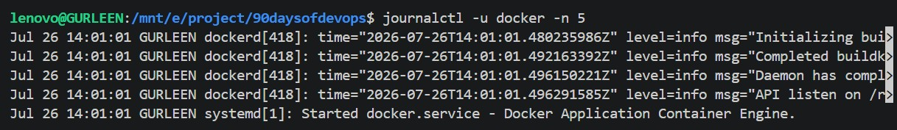

# This file is for troubleshooting
# we need to follow a basic steps :

A problem occurs --> Check service health --> Check CPU --> Check Memory --> Check Disk --> Check Network --> Read Logs --> Write findings --> Suggest next actions

1. I first decide a servise to do troubleshooting, for this i ran
`systemctl list-units --type=service --state=running`

2. I selected docker.service

3. to check status - `systemctl status docker` 

4. for CPU and memory - `ps -p 418 -o pid,%cpu,%mem,cmd` 
where 418 = PID of docker 

5. to check disk space - for filesystem usage - `df -h` 
for docker disk space - `docker system df`

6. to check logs- `journalctl -u docker -n 5`
here i see the latest 5 entries thats why its -n 5

*****  "df -h tells me whether the underlying filesystem has enough free space. If the host disk is full, Docker may fail to pull images, write container data, or create logs. For Docker's own storage consumption, I'd use docker system df."

Findings :-
Everything is working perfectly , no extra CPU, memory, disk space is used. logs were also looking fine. 

If the Docker service health became worse, the next steps would be :-
- Check for error messages in Docker logs (journalctl -u docker).
- Monitor CPU and memory continuously to identify resource spikes.
- Check Docker disk usage (docker system df) and free up space if needed.
- Verify the Docker daemon/socket is responding (docker info).
- Check for failed or stuck containers (docker ps -a).
- Restart the Docker service if necessary (sudo systemctl restart docker).
- Escalate the issue if it persists after basic troubleshooting.