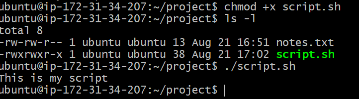
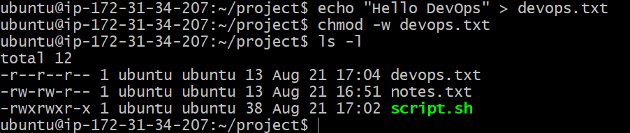
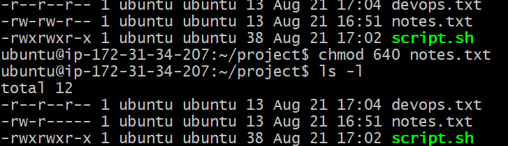
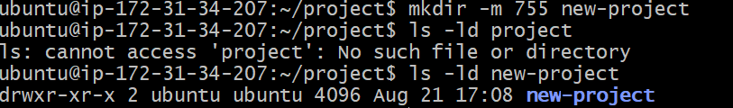

# FILE PERMISSIONS AND FILE OPERATIONS  
---------------------------------------------------------------------------------------------------

### Create Files
1. Create empty file devops.txt using touch
2. Create notes.txt with some content using cat or echo
3. Create script.sh using vim with content: echo "Hello DevOps"
4. Verify: ls -l to see permissions 

### Read Files  
- Read notes.txt using cat
Command : `cat <filename.txt>`

- View script.sh in vim read-only mode
Command : `vim -R <filename.txt>`

- Display first 5 lines of /etc/passwd using head
Command : `head -n 5 /etc/passwd`
- Display last 5 lines of /etc/passwd using tail
Command : ` tail -n 5 /etc/passwd`

### Understand Permissions  
**Format: rwxrwxrwx (owner-group-others)**
for eg- script.sh has -rxwrw-r-- 
where ;
`-` = file
`rxw` = user has read, write, execute permissions
`rw-` = group has read, write, no execute permission
`r--` = others only have read permissions, no write and execute

### Modify Permissions  
- Make script.sh executable → run it with ./script.sh

- Set devops.txt to read-only (remove write for all)

- Set notes.txt to 640 (owner: rw, group: r, others: none)

- Create directory project/ with permissions 755

### Test Permissions

- Writing to a read-only file - what happens?  
**Answer** : Writing to a read‑only file normally gives Permission denied. With sudo, you can override and write to the file — but only if the redirection itself is executed with root privileges (using tee or sudo bash -c). Even sudo won’t help if the file is set to immutable (via chattr +i) or mounted on a read‑only filesystem.

- Try executing a file without execute permission    
**Answer** : Executing a file without execute permission gives Permission denied. Even sudo cannot bypass this, because the shell requires the execute bit. However, you can still run the file by explicitly invoking the interpreter (e.g., bash script.sh or python3 script.py)

 

### Commands Used

- `touch <filename>` - Creates empty file.
- `echo "Hello" > <filename>` - Create file with content.
- `vim <filename>` - Create/open file in Vim.
- `cat <filename>` - Prints files content.
- `vim -R <filename>` - Open file in read only mode.
- `cat /etc/passwd | head -n 5` - Prints first 5 lines of /etc/passwd.
- `cat /etc/passwd | tail -n 5` - Prints last 5 lines of /etc/passwd.
- `chmod +x <filename>` - Adding executable permission for all(owner,group,others).
`chmod -w <filename>` - Removing write permission for all(owner,group,others).
- `mkdir -m 755 <directoryname>` - Create directory with permissions(rwx,r-x,r-x).

### What I Learned

- Managing files permissions effectively.
- Using sudo can override read & write restrictions
- Sudo cannot override execute permission but calling the interpreter directly allows execution.

